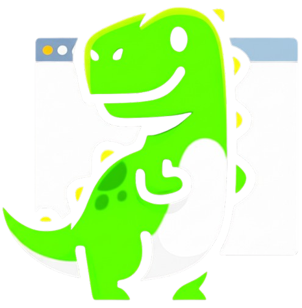

<div align="center">
    
    <h1>Postosaurus</h1>
    <p>Complete portfolio cum personal website solution for your digital personality.</p>
</div>

<br/>

## 📁 Project Structure

As this project is built upon docusaurus, it follows it's guidelines.

```
./
├── blog/
│   ├── ...
│   └── My mindset 
├── notes/
│   ├── ...
│   ├── sidebars.js
│   └── Self written notes, accessiable in /notes
├── src/
│   ├── components/
│   ├── css/
│   ├── pages/
│   │   ├─ ...
│   │   ├── index.js - entry point
│   │   └── holds standalone pages
│   └── ...
├── static/
│   ├── img/
│   ├── ...
│   └── static files
├── config.js
├── docusaurus.config.js
└── package.json
```

## 💻 Development

- Run the local development server:

    ```bash
    npm run start
    ```

- Build the website:

    ```bash
    npm run build
    ```

- Serve the built website locally:

    ```bash
    npm run serve
    ```