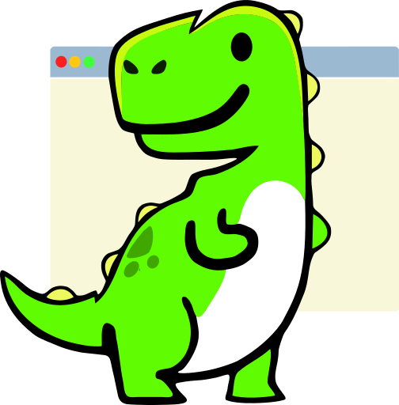

<div align="center">
    
    <h1>Portosaurus</h1>
    <p>Complete portfolio cum personal website solution for your digital personality.</p>
</div>

<br/>

## 🧩 Features

- **📝 Full-featured Portfolio Site** — Showcase your work, skills, experience, social identity.
- **🎨 Beautiful UI** — Responsive design with Catppuccin color scheme.
- **🛠️ Highly Configurable** — Extensive customization options in a central config file
- **🖼️ Project Showcase** — Interactive project cards with support for featured projects, project status badges, and tags
- **📚 Knowledge Base** — Integrated notes vault with many usefull utilities
- **✏️ Blog Platform** — Built-in blogging platform.
- **📋 Task Tracking** — Track your plans with priority levels and completion status
- **🔍 Powerful Search** — Integrated search functionality for notes and blog content
- **📱 Mobile-Friendly** — Fully responsive design works on all devices

<br/>

## � Getting Started

### 1. Create a New Project

Run the initialization command to set up your portfolio:

```bash
# With Bun
bunx portosaurus init my-portfolio

# with npm
npx portosaurus init my-portfolio
```

**Options:**

- `-ngh, --no-github-pages`: Skip setting up GitHub Actions workflow for deployment.
- `-ni, --no-install`: Skip automatic dependency installation.

### 2. Start Development Server

Navigate to your project and start the development server:

```bash
cd my-portfolio

# With Bun
bun run dev

# With npm
npm run dev
```

Your site will be available at `http://localhost:3000`.

### 3. Build & Deploy

#### GitHub Pages

1. Create a repository on GitHub named `yourUsername.github.io`.
2. Go to the repo's `Settings` > `Pages` > `Build and deployment` > `Source` > **`GitHub Actions`**.
3. Push your code:
   ```bash
   git remote add origin https://github.com/yourUsername/yourUsername.github.io.git
   git branch -M main
   git push -u origin main
   ```

#### Other Providers

A portosaurus project can be deployed to any static hosting provider like:

- Cloudflare Pages
- Netlify
- Vercel

To generate the static site for production:

```bash
# With Bun
bun run build

# With npm
npm run build
```

The output will be in the `build/` directory.

To preview the production build locally:

```bash
# With Bun
bun run serve

# With npm
npm run serve
```

<br>

## ⚙️ Configuration

Portosaurus is configured via `config.js` in your project root.

```javascript
module.exports = {
  usrConf: {
    hero_section: {
      title: "Your Name",
      description: "Software Engineer",
      // ...
    },
    // ...
  },
};
```

## Development

### Setup Environment

0. Fork This Repo
1. Clone forked repo: `git clone https://github.com/yourUserName/portosaurus.git`
2. Install Mise, visit [official guide](https://mise.jdx.dev/installing-mise.html)
3. Install Dependencies: `mise install`
4. Make changes
5. Stage & commit: `mise commit`
6. Push Changes: `git push`
7. Open PR: `mise pr`

<br>

## 📄 Credits

- [Docusaurus](https://docusaurus.io/) - The static site builder framework this is built upon.
- [React](https://react.dev) - UI library for building the interactive components.
- [React Icons](https://react-icons.github.io/) - Icon library used throughout the site.
- Libraries listed in [package.json](https://github.com/soymadip/portosaurus/blob/compiler/package.json#L16) - Essential dependencies.
- [Hugo Profile](https://hugo-profile.netlify.app/) - Design inspiration.
- [Catppuccin](https://github.com/catppuccin/catppuccin) - Color scheme that inspired the site's palette.
- [Deepseek R1](https://www.deepseek.com/) hosted using [Ollama](https://ollama.com/library/deepseek-r1) - prism.js theme & project card component.
- [Inkscape](https://inkscape.org/) - Icon drawing.
- Countless Internet forum posts - Filling me with information.
