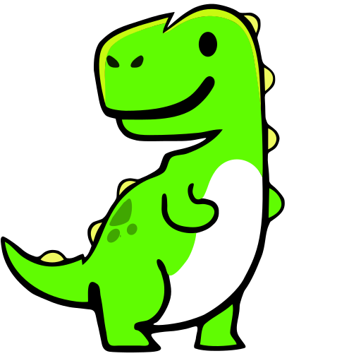

<div align="center">
    
    <h1>Portosaurus</h1>
    <p>Complete portfolio cum personal website solution for your digital personality.</p>
    <br />
</div>

## 🧩 Features

- **👨‍💻 Fully Featured Portfolio** — Showcase yourself, your projects, skills, experience & social identity.
- **📚 Knowledge Base** — Never forget a thing. Build your digital second brain with integrated notes vault.
- **📝 Blog Platform** — Share your journey in blog that's easy to write & beautiful to read.
- **📋 Task Tracking** — Track your plans with priority levels & completion status.
- **📱 Mobile Optimized** — Adapts seamlessly on all devices, from desktop to mobiles.
- **🛠️ Highly Configurable** — Extensive customization options through a central, logic-less config.

## Quick Start

Get your portfolio up and running in seconds:

```bash
# Initialize a new project
bunx portosaurus@latest init my-site   # or: npx portosaurus@latest init my-site

# Start development
cd my-site
bun run dev   # or: npm run dev
```

## Configuration

For full installation, configuration guide, CLI reference, visit the **[Documentation](https://soymadip.github.io/portosaurus/)**.

## Credits

- [Docusaurus](https://docusaurus.io/) - The core engine.
- [Catppuccin](https://github.com/catppuccin/catppuccin) - Color inspiration.
- [Hugo Profile](https://hugo-profile.netlify.app/) - Design inspiration.
- [VitePress](https://vitepress.dev) - Documentation site

---

<div align="center">
    Built with 🦖 by <a href="https://github.com/soymadip">soymadip</a>
</div>
